# Deploy na AWS com EC2

Processo de deploy da aplicação em uma instância AWS EC2 com VPC , Route Table e Security group.

Servidor web e proxy reverso com Nginx.

<div style="margin: 20px 0;">
  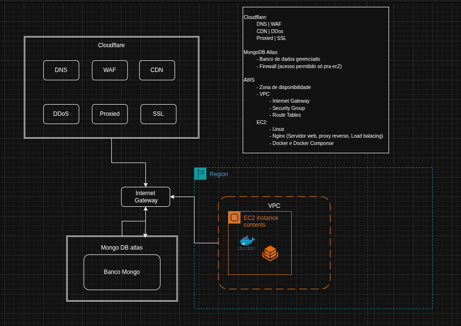
</div>

## Observação:

Ainda não foi implemntando domain name e gereciamento de dns e seguranças na cloudflare

---

## 1. Pré-requisitos
- [ ] Conta ativa na AWS com permissões para gerenciar EC2 e VPC.
- [ ] Chave SSH (`.pem`) criada e armazenada localmente de forma segura.
- [ ] Variáveis de ambiente da aplicação definidas.

---

## 2.AWS

### 2.1 VPC
- **Nome da VPC:** `VPC-PDV`
- **Bloco CIDR IPv4:** `10.0.0.0/24`
- **DNS Hostnames:** Habilitado.

<div style="margin: 20px 0;">
  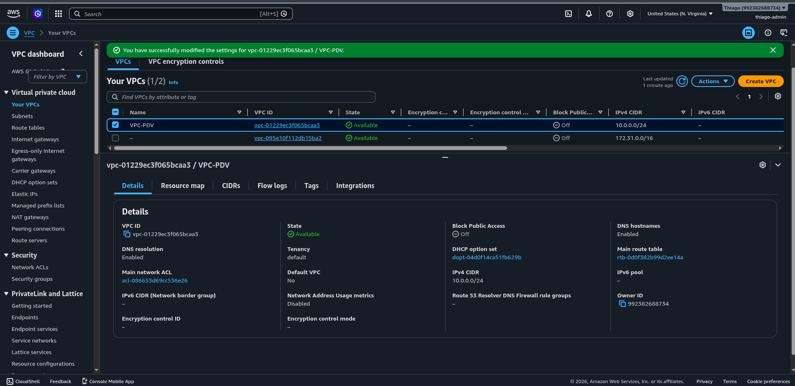
</div>

### 2.2 Subnets (Sub-redes)
Configuração de duas sub-redes para isolamento e alta disponibilidade (se necessário no futuro):

- **Subnet Pública 1:**
  - CIDR: `10.0.0.0/26`
  - Zona de Disponibilidade: `us-east-1a`
  - Atribuição automática de IP público: **Habilitado**.

<div style="margin: 20px 0;">
  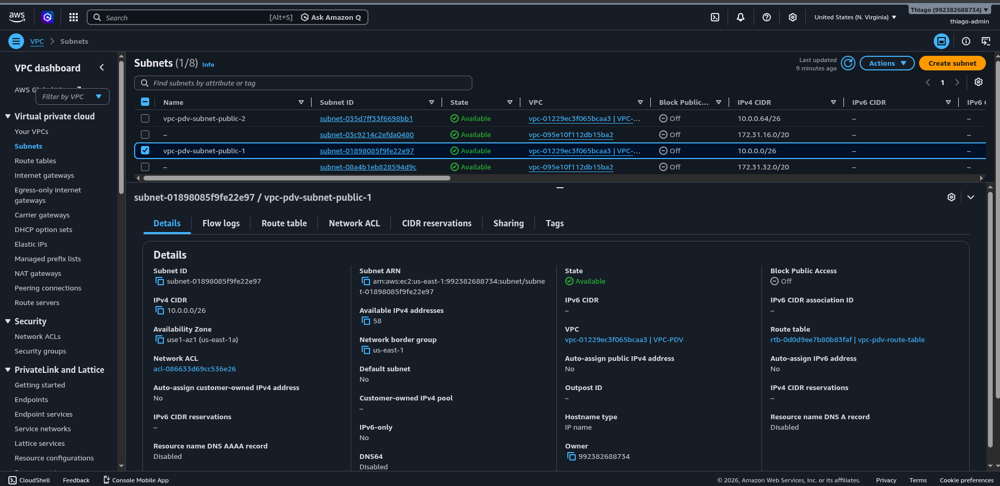
</div>


- **Subnet Pública 2**
  - CIDR: `10.0.0.64/26`
  - Zona de Disponibilidade: `us-east-1a`
  - Atribuição automática de IP público: **Habilitado**.

<div style="margin: 20px 0;">
  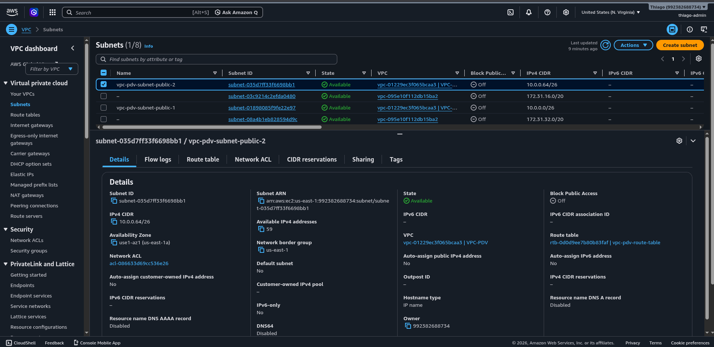
</div>

### 2.3 Internet Gateway (IGW)
- **Nome:** `vpc-pdv-internet-gateway`
- **Associação:** Vinculado diretamente à `VPC-PDV` criada acima para permitir tráfego de/para a internet.

<div style="margin: 20px 0;">
  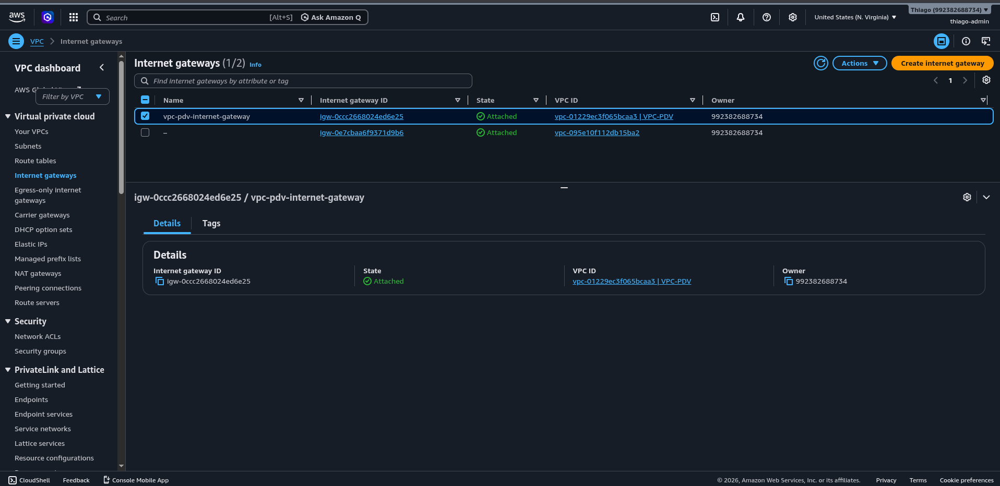
</div>


### 2.4 Route Table (Tabela de Rotas)
Tabela responsável por direcionar o tráfego da Subnet Pública para a internet através do Internet Gateway:
- **Nome:** `vpc-pdv-route-table`
- **Rotas (*Routes*):**
  - `0.0.0.0/0` -> Alvo: `vpc-pdv-internet-gateway` (Todo tráfego externo vai para a internet)
  - `10.0.0.0/24` -> Alvo: `local` (Tráfego interno da rede)

<div style="margin: 20px 0;">
  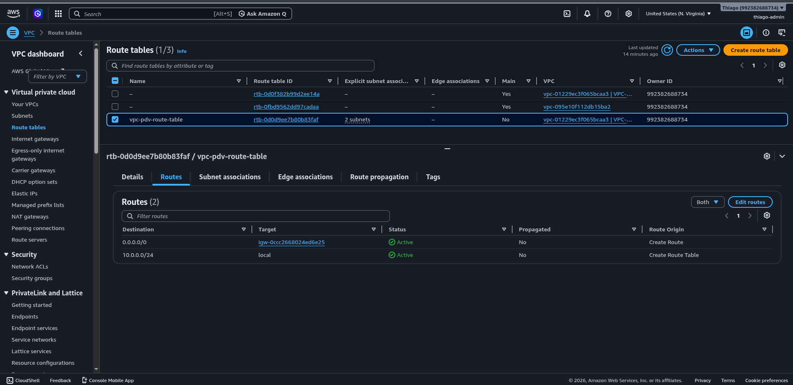
</div>

- **Associações de Subnet:** Associar explicitamente a **Subnet Pública 1 e 2**.

<div style="margin: 20px 0;">
  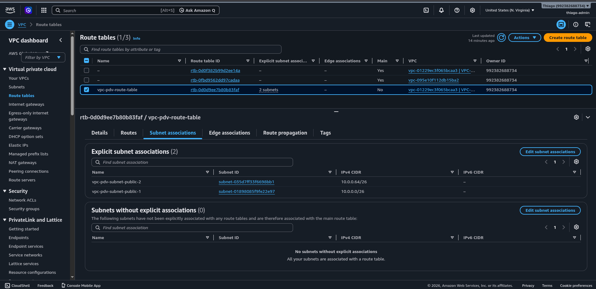
</div>

### 2.5 Security Group (Grupo de Segurança)
Configuração do firewall virtual para controlar o tráfego de entrada e saída da instância EC2.

*   **Nome do Security Group:** `security-group-pdv-1`
*   **VPC Associada:** `VPC-PDV`

#### Regras de Entrada (Inbound Rules)
| Tipo | Protocolo | Porta | Origem | Descrição |
| :--- | :--- | :--- | :--- | :--- |
| **SSH** | TCP | `22` | `Meu IP (ex: 200.x.x.x/32)` | Acesso restrito para administração segura |
| **HTTP** | TCP | `80` | `0.0.0.0/0` | Tráfego web público direcionado ao Nginx |
| **HTTPS** | TCP | `443` | `0.0.0.0/0` | Tráfego web seguro e criptografado público |

<div style="margin: 20px 0;">
  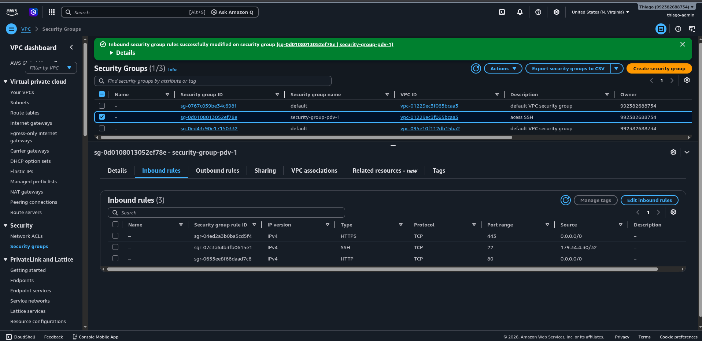
</div>

#### Regras de Saída (Outbound Rules)
| Tipo | Protocolo | Porta | Destino | Descrição |
| :--- | :--- | :--- | :--- | :--- |
| **Todo o tráfego** | Todos | `Todas` | `0.0.0.0/0` | Permite que o servidor baixe atualizações e pacotes |

<div style="margin: 20px 0;">
  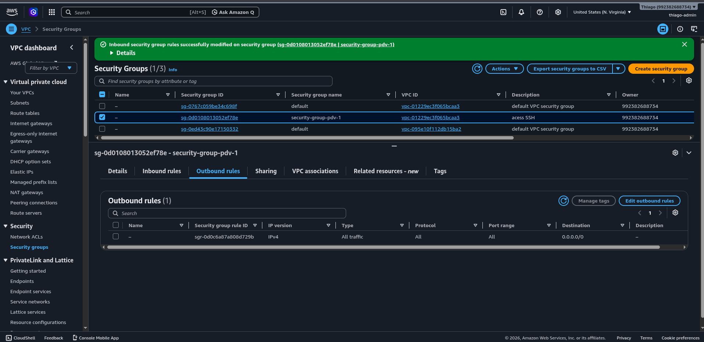
</div>


### 2.7. Instância EC2 free tier
- **AMI:** [debian-13]
- **Tipo de Instância:** [t3.micro ]
- **Armazenamento:** [8 GB]
- **Memoria ram:** [1 GB]

<div style="margin: 20px 0;">
  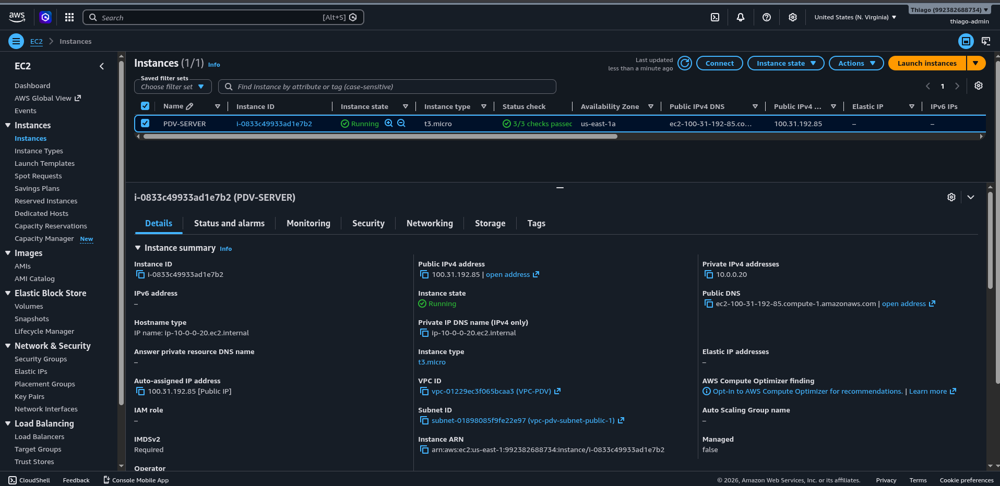
</div>

---

## 3. Preparação do Servidor (Provisionamento)
### 3.1 Acesso Inicial via SSH
```bash
ssh -i "sua-chave.pem" usuario@ip-publico-da-ec2
```

### 3.2 Atualização e Upgrade de Pacotes
```bash
sudo apt update

sudo apt upgrade -y
```

### 3.3 Criação de Usuário e Permissões Administrativas
```bash
sudo adduser thiago

sudo usermod -aG sudo thiago

sudo rsync --archive --chown=thiago:thiago ~/.ssh /home/thiago
```

### 3.4 Instalação do Docker, Docker Compose e Nginx
```bash
sudo apt install -y curl gnupg2 ca-certificates lsb-release debian-archive-keyring nginx

sudo mkdir -p /etc/apt/keyrings
curl -fsSL [https://download.docker.com/linux/debian/gpg](https://download.docker.com/linux/debian/gpg) | sudo gpg --dearmor -o /etc/apt/keyrings/docker.asc

echo \
  "deb [arch=$(dpkg --print-architecture) signed-by=/etc/apt/keyrings/docker.asc] [https://download.docker.com/linux/debian](https://download.docker.com/linux/debian) \
  $(lsb_release -cs) stable" | sudo tee /etc/apt/sources.list.d/docker.list > /dev/null"

sudo apt update

sudo apt install -y docker-ce docker-ce-cli containerd.io docker-buildx-plugin docker-compose-plugin

sudo usermod -aG docker thiago
```

## 4 Deploy da aplicação

### 4.1. Imagens no Docker Hub
Disponibilizados imagens atualizadas do projeto publicadas no Docker Hub. O servidor irá realizar o pull diretamente dos repositórios.

<div style="margin: 20px 0;">
  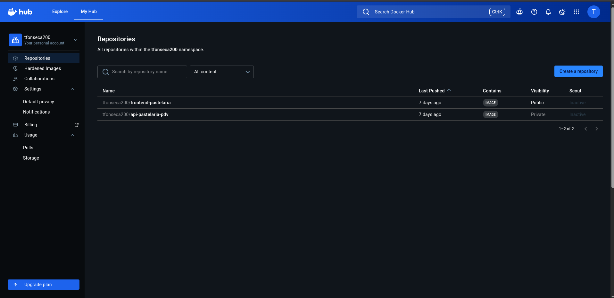
</div>

### 4.2 Configuração das Variáveis de Ambiente (.env)
```bash
sudo mkdir -p /app 

cd /app/

vim .env (aqui carrega todas variaveis do projeto)
```

### 4.3 API conectar com banco mongoDB Atlas
Para que a aplicação salve os dados corretamente, precisamos conectar a API ao cluster gerenciado no MongoDB Atlas.

<div style="margin: 20px 0;">
  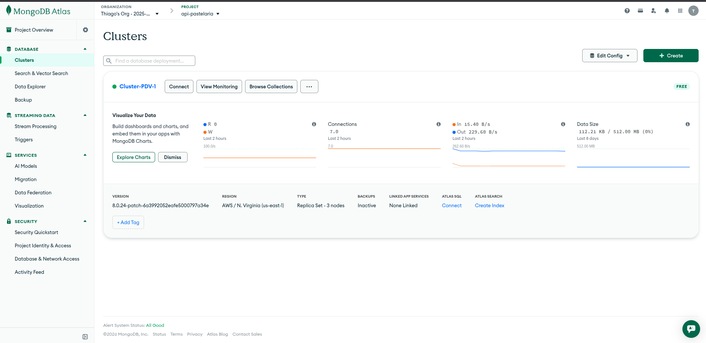
</div>

#### 1. Configuração no Painel do MongoDB Atlas
- Adição do **IP Público da sua instância EC2** para liberar o acesso.

<div style="margin: 20px 0;">
  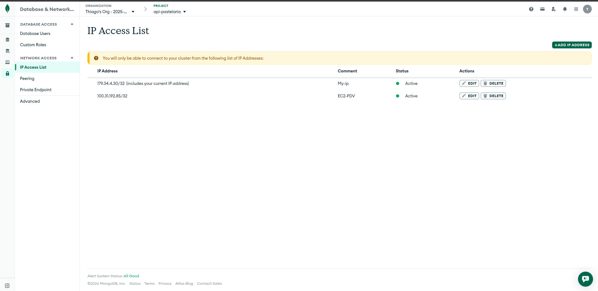
</div>

### 4.4 Configuração do Proxy Reverso com Nginx

```bash
sudo vim /etc/nginx/conf.d/app-pdv.conf
```

Arquivo conf de proxy reverso nginx:

```nginx
server {
    listen 80;
    server_name <ip-server>;

    location / {
        proxy_pass http://127.0.0.1:8080;
        proxy_set_header Host $host;
        proxy_set_header X-Real-IP $remote_addr;
        proxy_set_header X-Forwarded-For $proxy_add_x_forwarded_for;
        proxy_set_header X-Forwarded-Proto $scheme;
    }

    location /assets/ {
        proxy_pass http://127.0.0.1:8080/assets/;
        proxy_set_header Host $host;
        proxy_set_header X-Real-IP $remote_addr;
        proxy_set_header X-Forwarded-For $proxy_add_x_forwarded_for;
        proxy_set_header X-Forwarded-Proto $scheme;
        
        expires -1;
    }

    location /api {
        proxy_pass http://127.0.0.1:5000/;
        proxy_set_header Host $host;
        proxy_set_header X-Real-IP $remote_addr;
        proxy_set_header X-Forwarded-For $proxy_add_x_forwarded_for;
        proxy_set_header X-Forwarded-Proto $scheme;
    }
    
    location = /docs {
    return 301 $scheme://$http_host$request_uri/;
    }

    
    location /docs/ {
       proxy_pass http://127.0.0.1:5000/docs/;
       proxy_set_header Host $host;
       proxy_set_header X-Real-IP $remote_addr;
       proxy_set_header X-Forwarded-For $proxy_add_x_forwarded_for;
       proxy_set_header X-Forwarded-Proto $scheme;
    }
}
```

### 4.5 Testar a integridade e reiniciar serviço
``` bash 
sudo nginx -t
sudo systemctl restart nginx
```

### 4.5 Execução do Script de Deploy

``` bash 
chmod 700 deploy-ec2-pastelatia-pdv.sh
./deploy-ec2-pastelatia-pdv.sh
```

### 4.6 Validação Pós-Deploy
```bash
docker compose -f docker-compose.prd.yml logs -f app
```

## Resultado de deploy


<div style="margin: 20px 0;">
  
</div>

<br>

<div style="margin: 20px 0;">
  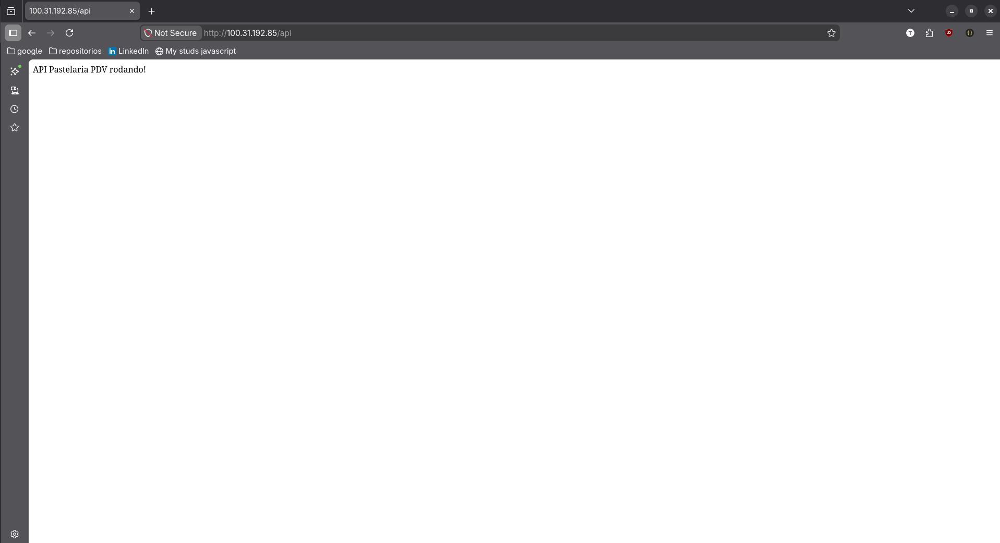
</div>

<br>

<div style="margin: 20px 0;">
  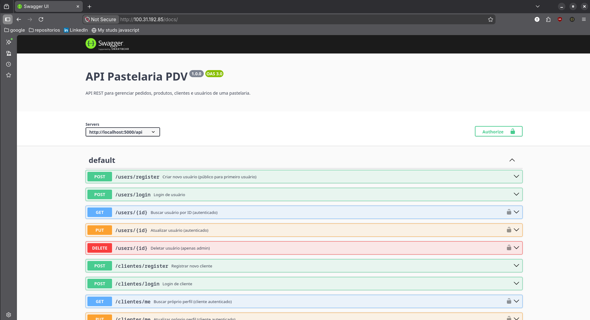
</div>

<br>

<div style="margin: 20px 0;">
  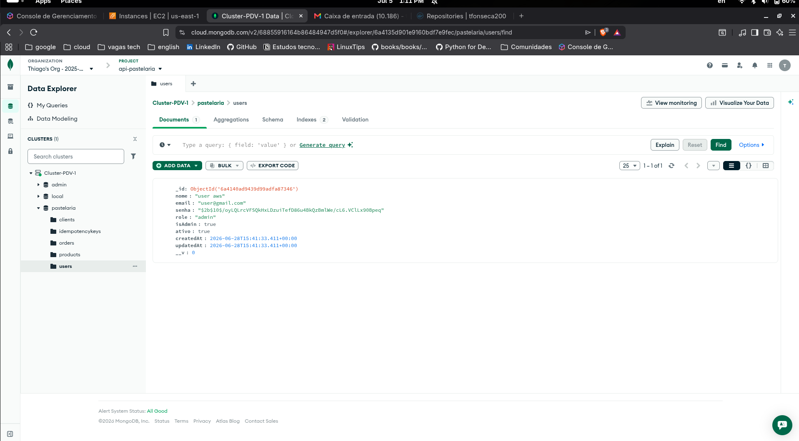
</div>

